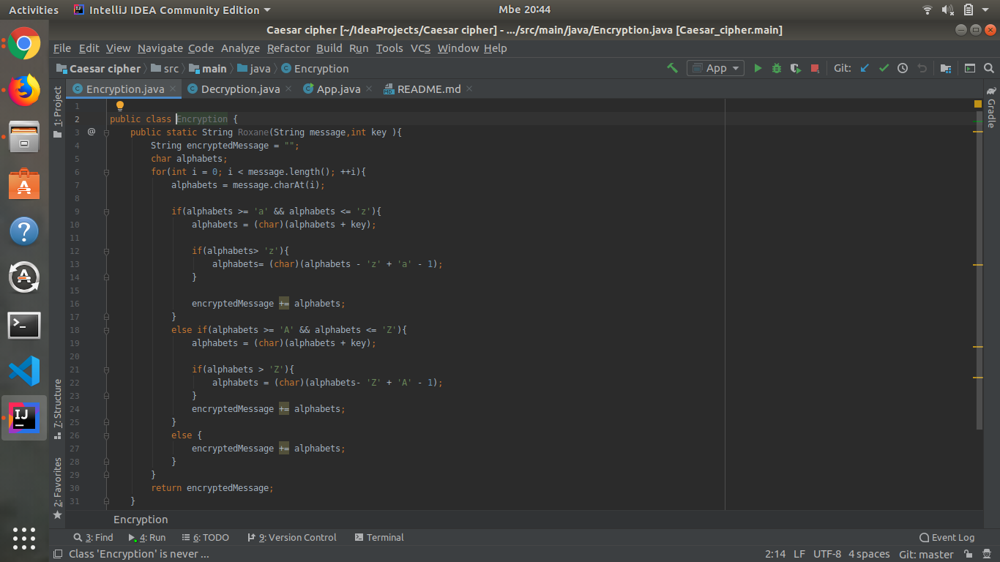
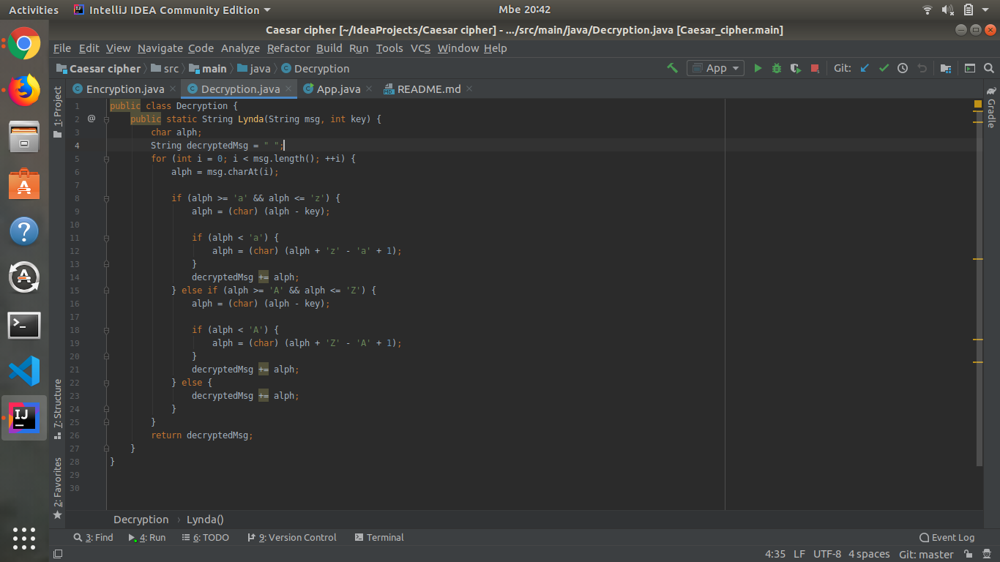
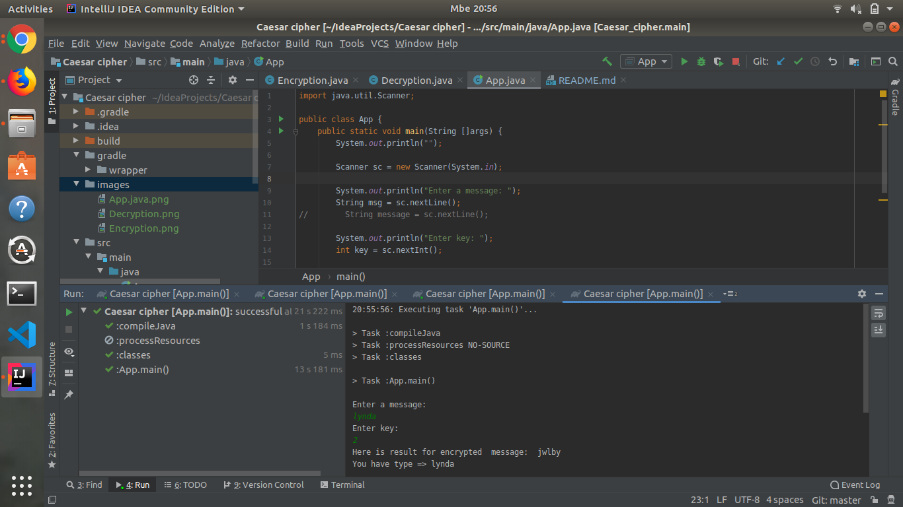

# Caesar-cipher(Encryption and decryption)
this is how it look:

## Description
Caesar cipher is a type of substitution in which each letter is shifted a certain 
number of places also known as a key, down the alphabet. For example, with a shift of 1, A would be 
replaced by B, B would become C, and so on. For more information on it, you can check this out https://en.wikipedia.org/wiki/Caesar_cipher.

### Author

author:lynda flower

##  Re-requisities

A couple of things to get you started:

Ensure you have Java installed
A simple way to install Java is using sdkman.

Simply follow the instructions to have sdkman installed and install java:

sdk install java
Gradle
Gradle is used as the build tool and can be installed with sdkman:

sdk install gradle
## Setup/Installation Requirements
{follow the below instructions for set up.}

1.You will need Internet connection.

2,You need to get into the Encrypter Repository.

Link:-> https://github.com/lyndaflowwer/caesar-cipher

3.From there you can access the Encrypter.

Clone the project.

4.get into project folder (cd into project).

5.If you have all the Pre-requisites you can run the application.

  gradle run
  
 ## Technologies Used
  * java - source language.
  * Gradle for dependency management and runningtasks.
  
 ## Support & contact
  * Email adress : umurerwalynda@gmail.com
  * github-username : lyndaflower
